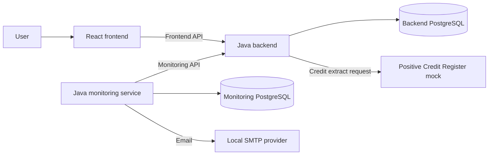

# Credit Lens

Credit Lens is a proof-of-concept system for requesting Finnish Positive
Credit Register extracts, viewing request history and reporting financing
requests made for consumers with an active voluntary credit ban.

## Current status

The repository currently contains the reviewed design baseline. Application
code, automated tests, local-run commands and deployment configuration have
not been added yet. This README describes the target PoC and will be updated
with executable instructions as implementation progresses.

## Assignment coverage

The planned solution covers the three required components:

- a frontend where a user starts a request and views history and details;
- a backend that calls a mocked Positive Credit Register API and stores the
  results;
- a monitoring service that periodically finds completed requests with an
  active voluntary credit ban and sends an email report to
  `pcr_monitoring@dansketest.dk`.

## Architecture

The monitoring service uses the backend API and never reads the backend
database directly. Each service owns its data.

## Target technology

| Component | Planned technology | Responsibility |
| --- | --- | --- |
| Frontend | React and TypeScript | Start requests and display history and details |
| Backend | Java 21 and Spring Boot | Own consumers, financing requests and credit extracts |
| Monitoring service | Java 21 and Spring Boot | Build reports and retry email delivery |
| Persistence | PostgreSQL and Flyway | Service-owned data and schema migrations |
| Register mock | WireMock | Documentation-based PCR responses and failures |
| Email | Mailpit or test SMTP adapter | Local email delivery and inspection |
| Local environment | Docker Compose | Start the complete PoC |

Library choices may be adjusted during implementation without changing the
service boundaries or domain contracts.

## Main flows

### Request and view a credit extract

1. The frontend assigns a `clientRequestId` to one user submission.
2. The backend validates the personal identity code and persists an
   `IN_PROGRESS` `FinancingRequest`.
3. The backend calls the register mock without holding a database transaction.
4. A valid response is stored as an immutable `CreditExtract` and the request
   becomes `COMPLETED`.
5. A timeout, rejection or invalid response leaves a visible `FAILED` history
   entry.
6. The frontend can search a consumer's history and open each request in
   detail.

A technical retry reuses the same `clientRequestId`, so the register is not
called twice for one submission.

### Build and send a monitoring report

1. The monitoring scheduler closes a half-open interval `[start, end)`.
2. It calls the backend monitoring API for completed requests with an active
   voluntary credit ban.
3. It stores an immutable `MonitoringReport` and its report items.
4. It sends the stored report by email.
5. If SMTP is unavailable, only delivery state changes; a later retry sends the
   same report content.

## Design documentation

- [Domain model](docs/domain-model.md) - business vocabulary, aggregates,
  states and invariants.
- [API contract](docs/api-contract.md) - frontend, monitoring and mock PCR
  HTTP boundaries.
- [Data model](docs/data-model.md) - PostgreSQL tables, constraints, indexes
  and transaction boundaries.

The official PCR reference used for the mock is
[Requesting a credit register extract - API description, version 2.1](https://www.vero.fi/globalassets/pore/dokumentaatio-2026/requesting-a-credit-register-extract---api-description_2.1.pdf).

## Resilience and error handling

- Connection and read timeouts are configured for the register client.
- Register failures are mapped to stable codes such as `PCR_TIMEOUT`,
  `PCR_UNAVAILABLE`, `PCR_REJECTED` and `PCR_INVALID_RESPONSE`.
- An interrupted request remains visible and is reconciled to
  `PCR_CALL_INTERRUPTED`.
- No database transaction stays open during an HTTP or SMTP call.
- Report creation is unique per interval.
- Email delivery is retried from persisted state without rebuilding a report.
- API errors use problem details and correlation IDs without exposing sensitive
  values.

## Testing strategy

The implementation should include:

- unit tests for state transitions, masking and report-selection rules;
- backend integration tests with PostgreSQL through Testcontainers;
- API tests for successful, failed and repeated financing requests;
- monitoring tests for interval boundaries and empty reports;
- email retry tests with the SMTP provider temporarily unavailable;
- one end-to-end happy-path test through the frontend, backend, mock and
  monitoring service.

## Security and privacy

The personal identity code is sensitive. It must not be written to logs,
metrics, traces, URLs, error responses or monitoring reports. The PoC stores it
as plain text only to keep the exercise focused. Production use requires
encryption or tokenization, a deterministic lookup value, access control,
auditing and an agreed retention policy.

Authentication and authorization are intentionally outside the PoC scope.
They are required before any production use.

## PoC scope

Included:

- the standard successful register response for a living consumer;
- request history with both successful and failed requests;
- one scheduled email report per interval;
- local mocks for the register and email provider.

Outside scope:

- the separate deceased-person register response;
- production-grade identity and access management;
- event streaming or an outbox;
- notification channels other than email;
- production retention and deletion policies.
