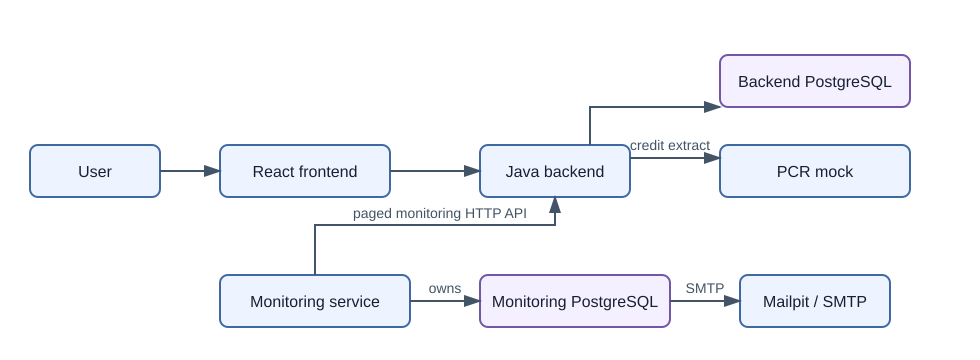

# Credit Lens

Credit Lens is a working proof of concept (PoC) for requesting Finnish
Positive Credit Register (PCR) extracts, reviewing successful request history
and details, and reporting financing requests for consumers with an active
voluntary credit ban.

The repository contains three applications: a React frontend, a Spring Boot
backend, and a scheduled Spring Boot monitoring service. PostgreSQL, WireMock,
and Mailpit support the local environment.

## Prerequisites

For the complete local deployment, install Docker with Docker Compose. Manual
development also requires Java 21, Node.js 22.12 or newer, and npm 11 or newer.

## Quick start

From the repository root, build and start the complete PoC:

```bash
docker compose up --build
```

Open these local endpoints:

| Service | URL |
| --- | --- |
| Frontend | `http://localhost:5173` |
| Backend health | `http://localhost:8080/actuator/health` |
| Mailpit inbox | `http://localhost:8025` |
| PCR WireMock | `http://localhost:8081` |

Compose keeps data in named PostgreSQL volumes. Stop the environment without
deleting those volumes:

```bash
docker compose down
```

See [development guidance](docs/development.md) for manual startup,
configuration, fixtures, seed data, real SMTP, and troubleshooting.

## Two-minute demo

1. Open `http://localhost:5173` and start a new request.
2. Use identity code `070790-123A` and any listed purpose. WireMock returns an
   extract with an active `ControlOfPersonalFinances` voluntary ban.
3. Open **Request history**, search for the same identity code, and view the
   saved extract details.
4. Wait for the two-minute monitoring schedule, then open Mailpit at
   `http://localhost:8025` and inspect the report.
5. Open `http://localhost:8080/actuator/health` and confirm the backend reports
   `UP`.

Mailpit captures mail addressed to `pcr_monitoring@dansketest.dk` inside the
local environment. It does not deliver the message to an external mailbox.

The same create flow can be called directly. Generate a fresh request ID for
each different input:

```bash
curl -X POST http://localhost:8080/api/v1/financing-requests \
  -H 'Content-Type: application/json' \
  -d "{\"clientRequestId\":\"$(uuidgen | tr '[:upper:]' '[:lower:]')\",\"personalIdentityCode\":\"070790-123A\",\"creditRegisterExtractPurposes\":[\"NewConsumerCredit\"]}"
```

## Assignment coverage

| Status | Requirement | Evidence |
| --- | --- | --- |
| Implemented | Request a PCR extract | Frontend form, backend API, synchronous WireMock integration |
| Implemented | View request history and details | Paginated history and immutable extract detail views |
| Implemented | Persist relevant data | Backend-owned PostgreSQL schema and Flyway migration |
| Implemented | Report active voluntary bans | Scheduled monitoring, persisted reports, SMTP delivery retry |
| Implemented | Illustrate errors and resilience | Validation, safe problem details, timeouts, PCR failure fixtures, retry paths |
| Implemented | Local setup and deployment | Multi-stage images and Docker Compose |
| Not included | Public or production hosting | Local PoC deployment only |
| Not included | Authentication, authorization, encryption, and retention controls | Required before production use |
| Not included | Automated browser-to-email end-to-end test | The full Compose happy path is manual |
| Optional | Two-minute walkthrough video | Not stored in this repository |

## Architecture



The frontend calls the backend under `/api`. The backend owns consumers,
financing requests, and immutable credit extracts. It calls PCR synchronously
outside a database transaction and persists a valid result in one short final
transaction.

The monitoring service calls the backend monitoring API; it never reads the
backend database. It stores immutable report content in its own database and
sends it through SMTP. Failed delivery is retried from the stored report.

## Verification

Run component checks from their directories:

```bash
cd frontend
npm ci
npm run lint
npm test
npm run build
```

```bash
cd backend
./gradlew check
```

```bash
cd monitoring-service
./gradlew check
```

For a full-system smoke check, start Compose and follow the
[two-minute demo](#two-minute-demo). This verifies the browser-to-backend,
PCR mock, persistence, monitoring, and Mailpit path manually.

## Key assumptions and trade-offs

- A stored `FinancingRequest` is successful and has exactly one immutable
  `CreditExtract`. Failed and in-progress requests are not persisted.
- PCR is synchronous for this PoC. A failed PCR call produces no history row.
- Reusing `clientRequestId` returns an already persisted matching result
  without another PCR call. It does not guarantee exactly-once PCR execution
  when the first call fails, times out, or overlaps with another call.
- Monitoring closes half-open time intervals: `completedFrom` is inclusive and
  `completedTo` is exclusive.
- Email delivery is at-least-once. A crash after SMTP accepts a message but
  before the `SENT` update can cause a duplicate.
- The mock covers the standard living-consumer extract used by the PoC. The
  deceased-person response and some PCR fields are outside the current model.

## Security and privacy

Personal identity codes are sensitive. They must not appear in logs, URLs,
responses, errors, metrics, traces, monitoring snapshots, or reports. Public
responses expose masked values.

The PoC stores the full code as plain text for lookup. Production use would
require encryption or tokenization, access control, audit records, retention
and deletion rules, and a reviewed secret-management approach. The current
system must not be described as production-ready or secure for real customer
data.

## Deployment scope

Docker Compose is the supported local PoC deployment. It builds and runs the
three applications with two PostgreSQL databases, WireMock, and Mailpit.

Public hosting, cloud infrastructure, high availability, production TLS,
managed secrets, backups, and operational observability are outside scope.
The repository demonstrates component boundaries and local execution, not a
production deployment.

## Effort

**Candidate action required:** replace this placeholder with the actual time
spent before submission. No reliable effort value is recorded in the
repository.

- Total effort: `[enter actual hours]`
- Optional breakdown: `[design / implementation / tests / documentation]`

## Further documentation

- [Domain model](docs/domain-model.md) - vocabulary, aggregates, invariants,
  and deliberate PoC trade-offs.
- [API contract](docs/api-contract.md) - HTTP operations, validation, errors,
  pagination, and idempotency.
- [Data model](docs/data-model.md) - schemas, constraints, indexes, and
  transaction boundaries.
- [Boundary and data flows](docs/credit-lens-dto-domain-data-flow.md) - the
  three application flows and privacy boundary.
- [Development guide](docs/development.md) - manual startup and local tools.
- [UI guidelines](docs/ui-guidelines.md) - current interaction, privacy, and
  accessibility guidance.
- [Historical documents](docs/archive/) - superseded design and detailed
  implementation snapshots.

The PCR mock is based on the Finnish Tax Administration's
[Requesting a credit register extract - API description, version 2.1](https://www.vero.fi/globalassets/pore/dokumentaatio-2026/requesting-a-credit-register-extract---api-description_2.1.pdf).
