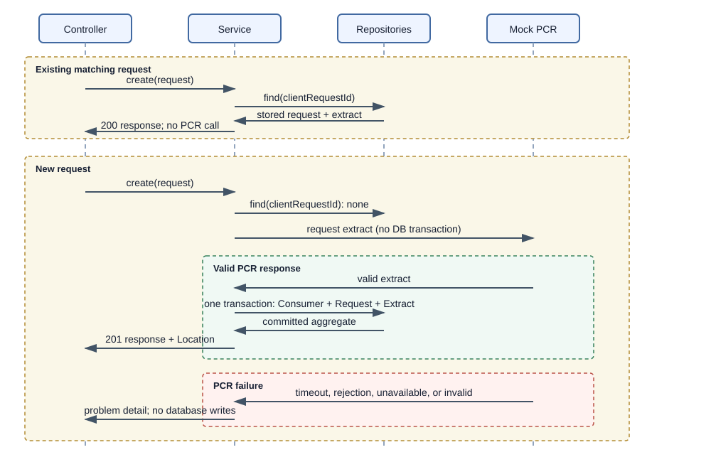

# Credit Lens API contract

Version: `v3`
Base path: `/api/v1`
Errors use `application/problem+json`.

## Create a financing request

`POST /financing-requests`

```json
{
  "clientRequestId": "ec2364ec-b4ed-4af7-805c-2bd44c42b9d5",
  "personalIdentityCode": "010190-123A",
  "creditRegisterExtractPurposes": ["NewConsumerCredit"]
}
```

The backend first checks `clientRequestId`. A matching successful request is
returned without another PCR call. A different personal identity code or
purpose list returns `409 Conflict`.

For a new request, PCR is called synchronously without an open database
transaction. Only after a valid response does one short transaction save the
Consumer, FinancingRequest and immutable CreditExtract together.

New requests return `201 Created` and `Location`; repeated requests return
`200 OK`. The internal `newlyCreated` flag is used only for that status choice
and is never serialized.

```json
{
  "id": "d46c2b84-d979-43e2-b0e4-bc7de12d2454",
  "clientRequestId": "ec2364ec-b4ed-4af7-805c-2bd44c42b9d5",
  "consumer": {
    "id": "d2fbb47f-2317-4740-8fa5-50f73b64182d",
    "maskedPersonalIdentityCode": "******-123A"
  },
  "creditRegisterExtractPurposes": ["NewConsumerCredit"],
  "requestedAt": "2026-09-18T10:15:29Z",
  "completedAt": "2026-09-18T10:15:30Z",
  "creditExtractSummary": {
    "extractReference": "2fdc1e0b-91d8-4d7c-9d4c-82df9c3b2a10",
    "creationTimeUtc": "2026-09-18T10:15:30Z",
    "voluntaryBanOnCredits": {"isInEffect": false, "reason": null},
    "lendersCount": 0,
    "loanContractsCount": 0,
    "guaranteedLoanContractsCount": 0
  }
}
```

The create response never contains `status`, `error`, a full personal identity
code, or `newlyCreated`.

## PCR errors

No request, consumer or extract is persisted when PCR fails. The failure is
returned as a problem detail and never appears in history:

| PCR condition | HTTP status |
| --- | ---: |
| timeout | 504 |
| connection failure or unavailable service | 502 or 503 |
| invalid response | 502 |
| rejected/validation request | 422 or 502 |

Problem details contain a safe generic detail, correlation ID and no upstream
payload or personal identity code.

## History and details

History and details expose only successfully persisted PCR fetches. Their
models contain `requestedAt`, `completedAt`, masked identity data and the
immutable extract; they do not contain status or error fields. An extract's
presence is the success indicator.

`POST /financing-requests/search` searches history by a
`personalIdentityCode` supplied only in the request body:

```json
{"personalIdentityCode":"010190-123A","page":0,"size":20}
```

`page` defaults to `0`; `size` defaults to `20` and accepts values from `1`
through `100`. The response is a `PageDto` with history items, ordered by
`requestedAt DESC, id DESC` and paginated by the database. An unknown consumer
returns an empty page. Only requests with an associated `credit_extract` are
included. The response contains masked identity data and no status or error
fields.

## Monitoring

`GET /monitoring/financing-requests?completedFrom=...&completedTo=...`

The interval is `[completedFrom, completedTo)`. Monitoring queries use
`completed_at` and the existence of `credit_extract`; they do not filter by a
financing-request status. Results remain ordered by `completedAt` and ID.

## Sequence


