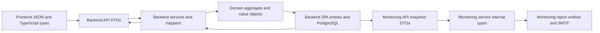
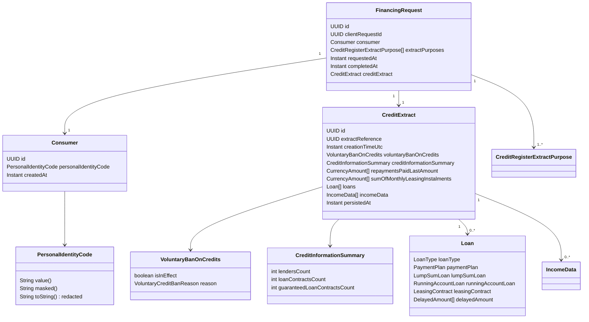
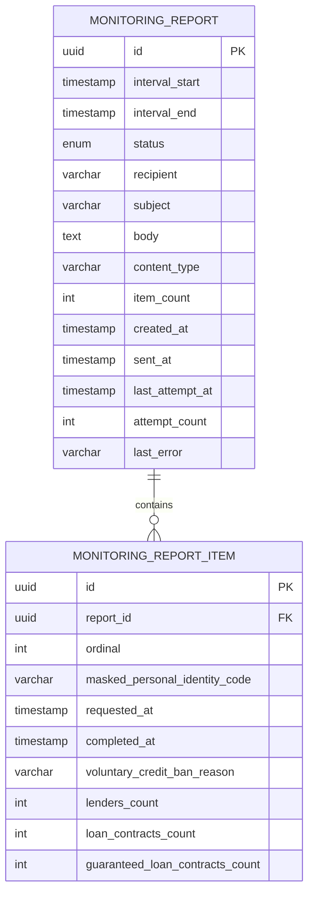
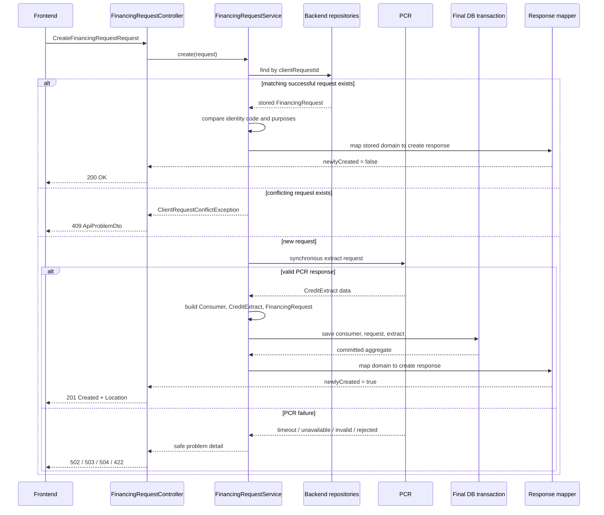
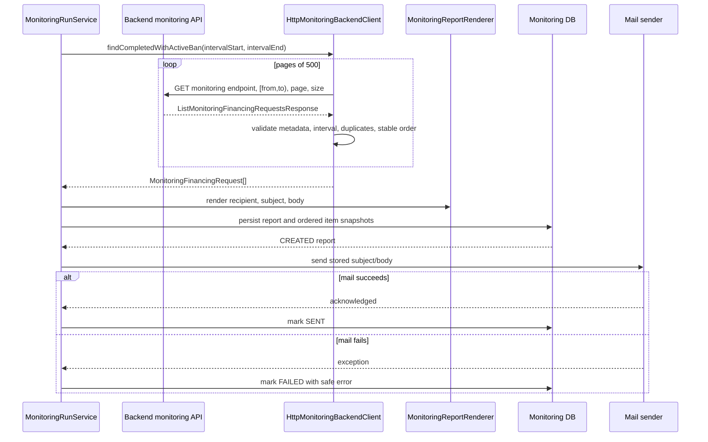

# Historical DTO, domain, entity, and data-flow reference

> Superseded: this detailed snapshot is retained as decision history. Some DTO
> details and UI gaps no longer match the implementation. Use
> [`../credit-lens-dto-domain-data-flow.md`](../credit-lens-dto-domain-data-flow.md)
> for the current boundaries and flows.

This document describes the current Credit Lens proof of concept as implemented in the repository. It maps HTTP DTOs to the domain model and persistence entities, then shows how data moves through create, history/details, and monitoring flows.

## Scope and invariants

- A persisted `FinancingRequest` is always successful and has exactly one immutable `CreditExtract`.
- The backend does not persist failed or in-progress financing requests. There is no financing-request status, error code, or error message in the domain or backend tables.
- PCR is called synchronously outside a database transaction. After a valid PCR response, `Consumer`, `FinancingRequest`, and `CreditExtract` are saved in one short final transaction.
- `clientRequestId` provides simple idempotency. A repeated matching request is returned without another PCR call; a conflicting request returns `409 Conflict`.
- The full personal identity code is used for validation and lookup inside the backend. API responses, URLs, logs, errors, metrics, traces, monitoring snapshots, report items, and email reports use masked values or omit the field.
- The monitoring service uses the backend monitoring API. It never reads the backend database directly.

## Layer map



## API DTO catalog

Controllers accept and return operation-specific DTOs. DTOs do not access repositories, PCR, or JPA entities directly.

### Operation DTOs

| Operation | DTO | Fields / nested DTOs |
|---|---|---|
| Create request | `CreateFinancingRequestRequest` | `UUID clientRequestId`; full `String personalIdentityCode`; `List<CreditRegisterExtractPurposeDto> creditRegisterExtractPurposes` |
| Create response | `CreateFinancingRequestResponse` | `id`; `clientRequestId`; `ConsumerDto`; purposes; `requestedAt`; `completedAt`; `CreditExtractSummaryDto`; internal `newlyCreated` flag ignored by JSON |
| History search request | `SearchFinancingRequestsRequest` | full `personalIdentityCode` in the request body; `page` default `0`; `size` default `20`, allowed `1..100` |
| History search response | `SearchFinancingRequestsResponse` | `FinancingRequestHistoryItemDto[]`; `page`; `size`; `totalItems`; `totalPages` |
| Details response | `FinancingRequestDetailsDto` | request metadata; `ConsumerDto`; purposes; complete `CreditExtractDto` |
| Monitoring request | `ListMonitoringFinancingRequestsRequest` | `completedFrom`; `completedTo`; `page` default `0`; `size` default `100`, allowed `1..500` |
| Monitoring response | `ListMonitoringFinancingRequestsResponse` | `MonitoringFinancingRequestDto[]`; `page`; `size`; `totalItems`; `totalPages` |
| Error response | `ApiProblemDto` | `type`; `title`; HTTP `status`; safe `detail`; `instance`; `correlationId` |

### DTO nesting

```mermaid
flowchart TB
    CREATE[CreateFinancingRequestResponse]
    CREATE --> CONSUMER[ConsumerDto]
    CREATE --> SUMMARY[CreditExtractSummaryDto]
    DETAILS[FinancingRequestDetailsDto]
    DETAILS --> CONSUMER
    DETAILS --> EXTRACT[CreditExtractDto]
    EXTRACT --> BAN[VoluntaryBanOnCreditsDto]
    EXTRACT --> INFO[CreditInformationSummaryDto]
    EXTRACT --> LOAN[LoanDto[]]
    EXTRACT --> INCOME[IncomeDataDto[]]
    INFO --> AMOUNT[CurrencyAmountDto[]]
    LOAN --> PLAN[PaymentPlanDto]
    LOAN --> LUMP[LumpSumLoanDto]
    LOAN --> RUNNING[RunningAccountLoanDto]
    LOAN --> LEASE[LeasingContractDto]
    LOAN --> DELAY[DelayedAmountDto[]]
    INCOME --> MONTH[MonthlyIncomeDto[]]
    SEARCH[SearchFinancingRequestsResponse] --> HISTORY[FinancingRequestHistoryItemDto[]]
    MONRESP[ListMonitoringFinancingRequestsResponse] --> MONITEM[MonitoringFinancingRequestDto[]]
```

### Nested and leaf DTOs

| DTO | Fields / relationship |
|---|---|
| `ConsumerDto` | `UUID id`; `String maskedPersonalIdentityCode` |
| `CreditExtractSummaryDto` | extract reference; creation time; `VoluntaryBanOnCreditsDto`; lender, loan-contract, and guaranteed-loan counts |
| `CreditExtractDto` | extract reference; creation time; ban; `CreditInformationSummaryDto`; `LoanDto[]`; `IncomeDataDto[]` |
| `CreditInformationSummaryDto` | three non-negative counts; `CurrencyAmountDto[] repaymentsPaidLastAmount`; `CurrencyAmountDto[] sumOfMonthlyLeasingInstalments` |
| `CurrencyAmountDto` | `currencyCode`; `sum` |
| `VoluntaryBanOnCreditsDto` | `isInEffect`; optional `VoluntaryCreditBanReasonDto reason`; active ban requires a reason and inactive ban cannot have one |
| `LoanDto` | `LoanTypeDto`; contract date; collateral flags/types; borrower count; currency; optional subtype DTOs; `DelayedAmountDto[]` |
| `PaymentPlanDto` | `isInDebtArrangement`; `isInBusinessRestructuringProgram` |
| `LumpSumLoanDto` | amount issued; amount paid; balance; planned final due date; amortization frequency |
| `RunningAccountLoanDto` | credit limit; balance; balance date |
| `LeasingContractDto` | contract period start date; transaction price |
| `DelayedAmountDto` | delayed instalment; original due date; foreclosure flag |
| `IncomeDataDto` | year; `MonthlyIncomeDto[]` |
| `MonthlyIncomeDto` | month; gross/net wages; gross/net benefits |
| `FinancingRequestHistoryItemDto` | request ID; client request ID; masked identity; timestamps; extract reference; active-ban flag |
| `MonitoringFinancingRequestDto` | financing-request ID; extract reference; timestamps; masked identity; ban reason; three summary counts |

### Enum DTOs

- `CreditRegisterExtractPurposeDto`
- `LoanTypeDto`
- `CollateralTypeDto`
- `VoluntaryCreditBanReasonDto`

## Domain model

The domain model carries business invariants and is independent of HTTP JSON and JPA.



### Domain types

| Domain type | Composition / invariant |
|---|---|
| `FinancingRequest` | Successful aggregate containing `Consumer`, at least one purpose, timestamps, and exactly one `CreditExtract`; `completedAt` cannot precede `requestedAt` |
| `Consumer` | `id`, `PersonalIdentityCode`, `createdAt` |
| `PersonalIdentityCode` | Validated value object; exposes full value only internally; `masked()` returns a masked suffix; `toString()` is redacted |
| `CreditExtract` | Immutable PCR result with summary, nested loans/income, and persistence metadata |
| `VoluntaryBanOnCredits` | Active ban requires a reason; inactive ban must not have a reason |
| `CreditInformationSummary` | Three non-negative counts |
| `CreditExtractData.CurrencyAmount` | Currency code and amount |
| `CreditExtractData.Loan` | Loan type, optional subtype records, collateral, payment plan, and delayed amounts |
| `CreditExtractData.IncomeData` | Year and monthly income records |
| `CreditExtractData.MonthlyIncome` | Month and gross/net wage and benefit amounts |
| `CreditRegisterExtractPurpose` | Domain enum corresponding to `CreditRegisterExtractPurposeDto` |
| `VoluntaryCreditBanReason` | Domain enum corresponding to `VoluntaryCreditBanReasonDto` |

## Persistence entities and database relationships

### Backend database

```mermaid
erDiagram
    CONSUMER ||--o{ FINANCING_REQUEST : owns
    FINANCING_REQUEST ||--|| CREDIT_EXTRACT : has

    CONSUMER {
        uuid id PK
        varchar personal_identity_code UK
        timestamp created_at
    }
    FINANCING_REQUEST {
        uuid id PK
        uuid consumer_id FK
        uuid client_request_id UK
        varchar_array extract_purposes
        timestamp requested_at
        timestamp completed_at
    }
    CREDIT_EXTRACT {
        uuid id PK
        uuid financing_request_id FK_UK
        uuid extract_reference UK
        timestamp creation_time_utc
        boolean voluntary_ban_active
        varchar voluntary_ban_reason
        int lenders_count
        int loan_contracts_count
        int guaranteed_loan_contracts_count
        jsonb repayment_amounts
        jsonb leasing_instalment_amounts
        jsonb loans
        jsonb income_data
        timestamp persisted_at
    }
```

| Entity | Table / relationship | Stored data |
|---|---|---|
| `ConsumerEntity` | `consumer`; one consumer can have many financing requests | unique full `personal_identity_code`; `created_at` |
| `FinancingRequestEntity` | `financing_request`; many-to-one to consumer | unique `client_request_id`; purposes as `varchar[]`; request timestamps |
| `CreditExtractEntity` | `credit_extract`; one-to-one with financing request through a unique FK | scalar summary columns plus nested arrays in JSONB; `persisted_at` |

The backend restores domain objects with `ConsumerEntity.toDomain()`, `CreditExtractEntity.toDomain()`, and `FinancingRequestEntity.toDomain(creditExtract)`. The entity constructors perform the reverse mapping for persistence.

### Monitoring database



`MonitoringReportEntity` and `MonitoringReportItemEntity` belong to a separate monitoring database. Report items intentionally do not store the financing-request ID, extract reference, or full identity code.

## Create flow



### Create data transitions

| Step | Data transition | Result |
|---:|---|---|
| 1 | Frontend payload -> `CreateFinancingRequestRequest` | UUID, identity-code, and non-empty-purpose validation |
| 2 | Request DTO -> service -> `clientRequestId` lookup | matching response, `409 Conflict`, or new flow |
| 3 | Request DTO -> PCR transport -> extract data | PCR executes synchronously with no DB transaction |
| 4 | PCR response -> `CreditExtract` + `Consumer` + `FinancingRequest` | aggregate exists only after a valid response |
| 5 | Domain -> `ConsumerEntity` + `FinancingRequestEntity` + `CreditExtractEntity` | one short final transaction |
| 6 | Domain -> `FinancingRequestResponseMapper` -> response DTO | `201` for new, `200` for repeat; `newlyCreated` is not serialized |

PCR failures do not create a failed history record. No request, consumer, or extract is persisted, and upstream payloads and full identity codes are not returned in errors.

## History and details flow

```mermaid
flowchart LR
    SEARCH[POST /financing-requests/search\nSearchFinancingRequestsRequest]
    SEARCHDB[Repository search by full identity code\nonly requests with an extract]
    HISTORY[SearchFinancingRequestsResponse\nFinancingRequestHistoryItemDto[]\nmasked identity]

    DETAILS[GET /financing-requests/{id}\nUUID path]
    DETAILDB[Load JPA entities\nrestore domain aggregate]
    DETAILRESP[FinancingRequestDetailsDto\ncomplete CreditExtractDto]

    SEARCH --> SEARCHDB --> HISTORY
    DETAILS --> DETAILDB --> DETAILRESP
```

- History is ordered by `requestedAt DESC, id DESC` and paginated by the database.
- An unknown consumer returns an empty page.
- Details never call PCR and return the complete immutable extract tree.
- Responses contain masked identity data and no financing-request status or error fields.

## Monitoring flow



The backend monitoring query uses `completed_at` in the half-open interval `[completedFrom, completedTo)`, joins to the existing extract, and filters `voluntary_ban_active = TRUE`. It does not filter by a financing-request status because no such status exists.

On a delivery retry, the monitoring service sends the already persisted report without calling the backend again.

## Transformation map

| Source | Mapping | Target | Boundary rule |
|---|---|---|---|
| `CreateFinancingRequestRequest` | service validation and enum conversion | `PersonalIdentityCode` + `CreditRegisterExtractPurpose[]` | full identity code remains inside backend |
| PCR response | `PcrCreditExtractMapper` | `CreditExtract` + `CreditExtractData` | valid response becomes an immutable domain result |
| `FinancingRequest` | JPA entity constructors | `ConsumerEntity` + `FinancingRequestEntity` + `CreditExtractEntity` | saved in one final transaction |
| JPA entities | `toDomain()` methods | `Consumer` + `CreditExtract` + `FinancingRequest` | domain invariants are re-established on restore |
| `FinancingRequest` | `FinancingRequestResponseMapper.toCreateResponse` | `CreateFinancingRequestResponse` | summary only; masked `ConsumerDto` |
| `FinancingRequest` | `FinancingRequestResponseMapper.toDetailsResponse` | `FinancingRequestDetailsDto` | complete extract tree |
| monitoring projection | `MonitoringFinancingRequestService.toDto` | `MonitoringFinancingRequestDto` | mask identity and emit active-ban snapshot |
| monitoring API JSON | Jackson record mapping | `MonitoringFinancingRequest` | monitoring service internal type |
| `MonitoringFinancingRequest[]` | renderer and persistence mapping | `RenderedReport` + monitoring report entities | independent snapshot for delivery and retry |

## Sensitive and intentionally absent fields

| Field / object | Present in | Absent or masked in |
|---|---|---|
| `personalIdentityCode` | create request; `PersonalIdentityCode`; `ConsumerEntity`; search request body | response DTOs; URLs; logs; errors; metrics; traces; monitoring API output |
| `maskedPersonalIdentityCode` | `ConsumerDto`; history item; monitoring DTO; report item | not used for backend lookup |
| Financing-request `status` / `error` | nowhere in backend financing-request domain, entities, or responses | failed PCR calls are represented only as problem responses |
| `MonitoringReportStatus` | monitoring email-delivery entity only: `CREATED`, `SENT`, `FAILED` | not a financing-request status |
| `newlyCreated` | internal create response field | JSON response; used only to choose `200` versus `201` |
| `financingRequestId` and `extractReference` | monitoring API DTO and transport response | monitoring report item snapshots by design |

## Source references

- `README.md`
- `docs/domain-model.md`
- `docs/api-contract.md`
- `docs/data-model.md`
- `backend/src/main/java/com/creditlens/backend/api/dto`
- `backend/src/main/java/com/creditlens/backend/domain`
- `backend/src/main/java/com/creditlens/backend/persistence/entity`
- `backend/src/main/java/com/creditlens/backend/api/mapper`
- `monitoring-service/src/main/java/com/creditlens/monitoring/integration`
- `monitoring-service/src/main/java/com/creditlens/monitoring/persistence`
