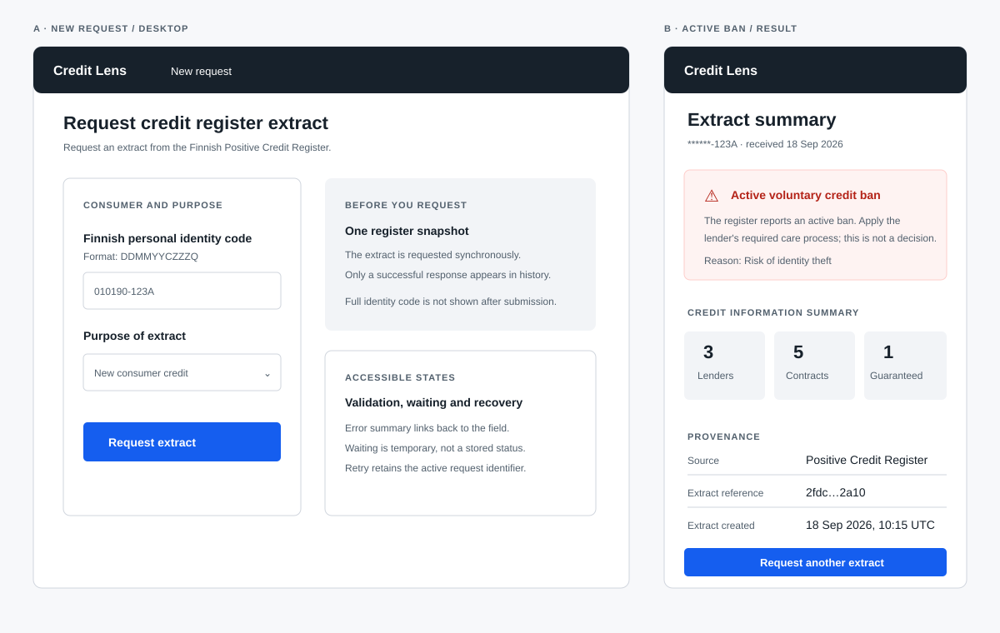
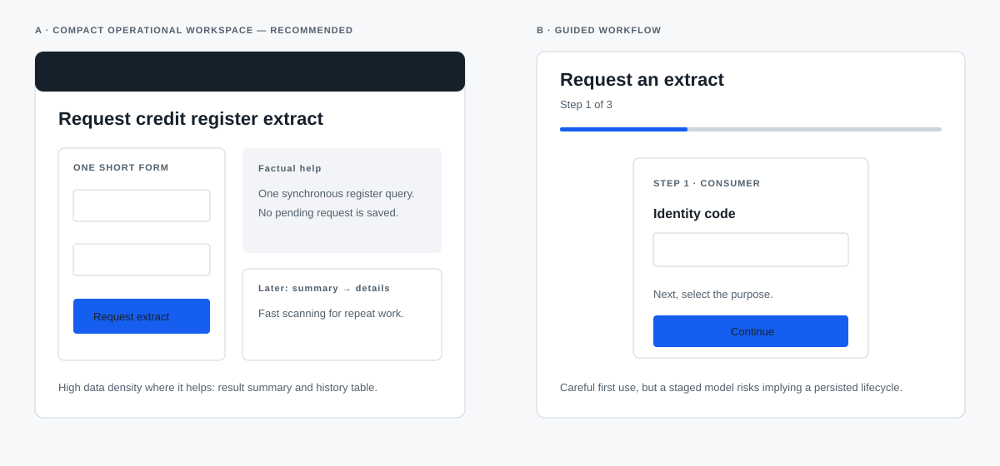
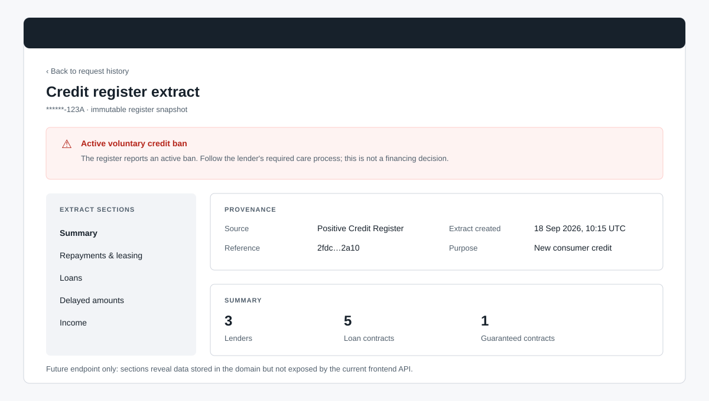

# Historical Credit Lens UI/UX design proposal

> Superseded: this proposal predates the implemented detail view and other UI
> changes. It is retained as design history. Use
> [`../ui-guidelines.md`](../ui-guidelines.md) for current guidance.

_Version 1.0 · 20 September 2026 · design discovery for the current PoC_

## 1. Executive summary

Credit Lens is a narrow B2B workspace for an employee of a lender to request and inspect a Finnish Positive Credit Register extract. The project documentation does not name the role precisely; this proposal therefore uses **credit assessor / lending operations employee** as the working role. It must be validated with the product owner.

The recommended direction is **a compact operational banking workspace**: a persistent, low-noise shell; a short request form; and a request detail view that makes the extract's provenance, the active voluntary credit ban, and the few currently available facts immediately legible. It deliberately does **not** present a credit decision, approval, score, case status, or monitoring dashboard.

The largest implementation constraint is not visual. The backend persists a much richer immutable extract (loans, delayed amounts, repayment/leasing amounts and income) than the create and history API expose. The proposal makes a useful PoC from the current contract, while clearly reserving the detailed extract for a separate, privacy-reviewed API addition.

## 2. Product and users

### Product boundary

The frontend starts a synchronous PCR query, displays the returned summary and searches successfully persisted requests. A stored `FinancingRequest` is successful by definition, has one immutable `CreditExtract`, and has no saved status or error. PCR is called outside a database transaction. Monitoring is a separate service that calls the backend and emails reports; it is not a frontend area.

### Primary user and JTBD

| User | Job to be done | Success signal |
| --- | --- | --- |
| Credit assessor / lending operations employee (assumption) | When assessing a consumer financing request, request the relevant PCR extract and understand the register facts without missing a credit ban. | A valid extract is obtained once, its source/time and masked consumer are clear, and no fact is mistaken for a lending decision. |
| Same employee, returning to a case | Find prior successful extracts for a consumer without exposing their identity code outside the search field. | Relevant completed requests are found, distinguishable by time and immutable extract reference. |

The documentation confirms lenders request extracts during loan applications, but does not define frontend personas, their languages, decision policy, or whether the tool supplements another underwriting system.

### Key journeys

1. **Request and inspect:** enter PIN in the one allowed input, choose the statutory/business purpose, submit, wait synchronously, inspect the summary, then proceed in the lender's own decision process.
2. **Risk interruption:** receive an extract with a voluntary ban; notice it before interpreting secondary counts; read the reason if supplied; act with heightened care, without the UI declaring the loan rejected.
3. **Find prior extract:** search by PIN in a POST body, see only completed requests, choose a row, and open its immutable details (requires the proposed details endpoint).
4. **Recover safely:** correct a local validation error, retry a technical failure with the same in-memory `clientRequestId`, or resolve an upstream rejection without creating a fictional history record.

## 3. Current-state UI audit

Review basis: source inspection of `frontend/src`, the API client/types, backend DTO/domain classes and SVG docs; visual review of the running Vite application at desktop and 390px. The local backend was not started, so success/error rendering was assessed from source plus documented fixtures. No product code was changed.

| Screen / component | Observation and user impact | Severity | Recommended change |
| --- | --- | --- | --- |
| App shell / hero | The oversized “A clearer view…” marketing hero consumes the initial mobile viewport before the task. It frames a sensitive internal workflow as a consumer landing page. | High | Replace with task title, brief purpose and last-resort support context; put form above the fold. |
| Result (`FinancingRequestResult`) | `Active` is a plain value in a definition list, with no icon, banner, reason, priority placement, or explicit “not a decision” framing. An assessor can miss a critical signal. | Critical | Dedicated alert region first in result; text + icon + semantic role + concise action guidance. |
| Result | The current summary omits the extract creation time despite API support; it includes no “source: Positive Credit Register” or immutable-extract explanation. | Medium | Add provenance strip: source, extract reference, creation/completion time, and immutable snapshot label. |
| Result / history | The information is only a summary. The backend domain stores loans, delayed amounts, repayment/leasing totals and income, but neither API has a detail contract. UI currently suggests a result is complete when it is not. | High | Label it “Extract summary”; add “View full extract” only after a detail API exists. |
| History | Results are card stacks, not a scannable table; no row action or detail route exists. Full UUID-like extract references dominate the scan. | High | Desktop table with a row action; mobile cards. Use truncated reference with copy action only if operationally necessary. |
| History | It calls the page a set of “completed requests”, but the summary/record has no status. This wording is defensible as an outcome but the `01 / 01` badge falsely implies a workflow step. | Medium | Say “Successful requests” in explanatory copy and remove the step badge. Never render status chips. |
| Create / error state | Server API errors share one generic error panel and no next action. `422` (PCR rejected), `504` timeout, `502/503` unavailable, and network failure need distinct recovery copy. | High | Map error category to separate safe, actionable panels; show correlation ID as a support reference. |
| Create / retry | Retry identity is held only in React state. The UI offers no explicit “Retry this request” action or explanation that it reuses the same request ID. Navigation/reload loses it. | High | Keep an error state in-place with a primary Retry button; state that retrying uses the same submission while the tab remains open. Do not promise exactly-once execution. |
| Form / validation | Inline error is present and the form uses `noValidate`, but there is no error summary/focus management and no input hint about required format/purpose. | Medium | Error summary linked to input, focus it after submit; persistent format hint and purpose help text. |
| Privacy language | Footer says “Your data stays private”, an unverified security promise; the PIN field is retained visible after local validation and search only clears it after a response. | High | Remove absolute claim. State factual handling only where confirmed; clear PIN after submit and after successful search while retaining masked result. |
| Accessibility | Native controls and labels are a good baseline; visible focus exists. However no skip link, no main-page focus reset on nav switch, no reduced-motion treatment, no explicit live-region completion/error focus, and current green/red contrast must be verified. | Medium | Implement the accessibility requirements in §14 and test keyboard, screen reader and contrast. |
| Responsive | At 390px the layout stacks cleanly, but large heading/hero leaves little task context; a history data set will become a long card list without explicit mobile ordering. | Medium | Task-first mobile layout; critical alert fixed at top of result; transform table columns to labelled cards. |

## 4. Domain-to-UI mapping

| Domain truth | UI consequence |
| --- | --- |
| Stored request = successful immutable fetch | History has no status column, progress row or “failed” entry. Show “Successful request” only as explanatory history copy, not as a persisted status. |
| One immutable extract | Details show an “immutable register snapshot” label and source/reference/time; no edit affordance. |
| PCR synchronous, outside transaction | Submission is a temporary waiting state, not a saved pending request. Leaving the screen during it must warn only if an implementation chooses to; it must not create a draft record. |
| `clientRequestId` idempotency | Retrying a technical failure in the active tab reuses the same ID and input/purpose. Conflict explains that an identical successful request exists or inputs differ; never put its PIN in copy. |
| PIN is sensitive | Full code only in the create/search input. Clear it after submission/search; no URL query, title, breadcrumb, toast, error, telemetry label, report preview or copied reference contains it. |
| Active voluntary ban | A high-priority factual signal, not an approval/decline. Pair icon, heading, text and placement; reason only when returned. |
| Monitoring is backend-to-backend | No “Monitoring” navigation, settings, alert count or email history in this PoC UI. |

## 5. Competitive and pattern research

The table distinguishes a directly observed/publicly documented pattern from an inference for this PoC. These are pattern references, not visual templates.

| Reference | Confirmed public observation | Applicable pattern | Transfer limit |
| --- | --- | --- | --- |
| [Finnish Positive Credit Register — voluntary ban](https://www.vero.fi/en/positivecreditregister/for-private-individuals/voluntary-ban-on-credits/) | A ban is visible on the extract and lenders must exercise extra care; it does not affect existing credit. | Give the ban first-position, factual prominence and avoid auto-decision language. | The page is a consumer information service, not an assessor UI. |
| [PCR API description](https://www.vero.fi/globalassets/pore/dokumentaatio-2026/requesting-a-credit-register-extract---api-description_2.1.pdf) | The register responds with credit/income data and ban information. | Source/time/reference afford traceable interpretation. | Credit Lens intentionally maps only a subset; do not expose raw PCR fields absent from the domain/API. |
| [nCino platform](https://www.ncino.com/our-platform) | It describes lending through origination, underwriting, pricing, compliance and monitoring, with workflow views. | Persistent task context and progressive disclosure are useful. | Do not import its lifecycle, approvals, checklists or portfolio dashboard into the PoC. |
| [Experian PowerCurve Originations](https://www.experian.com.au/business/solutions/ascend-platform/decisioning-ascend) | It combines application, data, policy, workflow and decision capabilities. | Separate source facts from decision/policy results in the interface. | Credit Lens has only source facts; no score, policy, eligibility or decision UI. |
| [Finastra Fusion Essence overview](https://www.finastra.com/sites/default/files/file/2021-11/resource-fusion-essence-end-to-end-lending-capabilities.pdf) | A broad lending system includes servicing, arrears, authorisation and operational reporting. | Dense information should be sectioned by decision relevance rather than decorated. | Those modules are out of scope. |
| [Experian credit report guide](https://gateway.secure.experian.com/bizapps/pdf/AAUserGuide.pdf) | The documented customer view groups customer data, risk information and influencing factors. | A stable summary before detail helps triage a long report. | Do not infer or invent a risk score/factors for PCR. |
| [GOV.UK validation pattern](https://design-system.service.gov.uk/patterns/validation/) | Accessible validation uses an error summary, linked inline errors, focus management and retained correct input. | Use an error summary plus field error after submit. | The visual styling need not imitate GOV.UK. |
| [GOV.UK error summary](https://design-system.service.gov.uk/components/error-summary/) | Summary messages link to offending fields and receive focus. | Exact accessibility behaviour for PIN validation. | General service failures use a separate recovery panel, not form validation. |

### Research conclusions

1. A register extract should be read as a **source snapshot**; provenance and timestamp are first-class facts.
2. High-risk exceptions deserve a dedicated region before normal summary data; colour is supplemental.
3. The right progressive disclosure is summary → detail, not a dashboard of invented KPIs.
4. A PoC should retain one focused workspace and history, while leaving workflow, policies and monitoring out.

## 6. User journeys and Jobs to Be Done

The primary user/JTBD table and the four end-to-end journeys in §2 are the agreed design basis for this proposal. The operational priorities are: accurate request entry, immediate recognition of an active ban, unambiguous source provenance, safe technical recovery, and retrieval of successful immutable snapshots. They must be validated through contextual observation or usability sessions with the named lender role before visual implementation is considered final.

## 7. Design principles

1. **Facts before decoration.** Make source, timing, ban and counts readable before visual flourish.
2. **Signal without deciding.** Identify what the register says; never label financing “approved”, “declined”, “safe” or “high risk”.
3. **Privacy by disappearance.** Treat full PIN as transient input, not page content.
4. **One task at a time.** Submission and retrieval are separate primary spaces; result detail is contextual rather than a third dashboard.
5. **Recover, do not mystify.** State what happened, what was not saved, and the safe next action.
6. **Accessible by construction.** Semantic structure, keyboard focus and text equivalents lead visual treatment.

## 8. Proposed information architecture

**Primary navigation:** `New request` · `Request history`.

**Contextual navigation:** result → `Back to new request`, history row → `Request details` (once available), details → `Back to history`. The active area gets `aria-current="page"`; switching areas moves focus to the page `<h1>`.

No global search, dashboard, monitoring, consumer profile, approval queue, audit log or settings is proposed. This keeps the shell aligned with the current two frontend jobs.

## 9. Two design directions

### A. Compact operational banking workspace — **recommended**

**Idea and structure:** slim header; two task tabs; 12-column desktop content grid. New request is a 5-column form with a 7-column “what happens next” factual sidebar. Result begins with a full-width ban/no-ban signal, then a compact summary and provenance. History is a table at desktop.

**Visual character:** ink/navy text, neutral surfaces, restrained blue interaction colour, amber attention and red critical alert. Dense but breathable tables; no gradients or decorative charts.

**Strengths:** fast repeated operation, strong scanning, works with a summary now and detailed extract later, maps directly to the two existing API operations. **Weakness:** needs disciplined information hierarchy or it can feel austere. **Fit:** high.

### B. Guided extract workflow

**Idea and structure:** a centred single-column sequence: identity → purpose → confirmation/loading → summary → optional detail sections. Each section opens only after the prior action.

**Visual character:** larger type, generous whitespace, explanatory side notes and clear step framing.

**Strengths:** lowers first-use cognitive burden and supports careful input. **Weakness:** slows repeat assessors, risks implying a persisted multi-step application lifecycle, and hides comparison/history affordances. **Fit:** moderate, appropriate only if research shows infrequent novice use.

## 10. Chosen direction and rationale

**Choice:** A. The documented model is one synchronous evidence fetch, not a multi-stage financing application. Assessors need fast triage and later retrieval; compact progressive disclosure supports both without inventing statuses.

## 11. Detailed screen specifications

### 9.1 New financing request

**Goal:** submit one justified register request accurately. **Hierarchy:** page title “Request credit register extract”; short use statement; PIN; purpose; primary button; then factual privacy/help text. **Layout:** desktop form 5/12 columns, help panel 7/12; mobile one column. **Components:** labelled text field, persistent hint `Format: DDMMYYCZZZQ`, purpose select with selected-item explanation, error summary, primary button.

**Rules:** validate only on submit; normalise safe whitespace/case; preserve input only after local validation failure; after network/PCR submission clear visual PIN and retain it only in memory necessary for same-tab retry. Disable double submission. **Actions:** `Request extract`; secondary `Clear form` only when values exist. **Data now:** all create payload fields. **A11y/privacy:** `autocomplete="off"`; error summary receives focus; field errors use `aria-describedby`; never announce PIN; 44px target; no full PIN in browser history.

### 9.2 Synchronous waiting for PCR

**Goal:** understand that work is in progress and avoid duplicate submissions. **Layout:** replace button/form action region with spinner and “Requesting extract from the Positive Credit Register”; keep the rest read-only and visually de-emphasised. **Rules:** use `role="status" aria-live="polite"`, announce once; no fake percent/progress estimate; no temporary record/status. Offer `Cancel` only if AbortController cancellation is implemented, wording “Stop waiting” and explain result may still complete upstream; otherwise omit. **Mobile:** content remains in normal flow. **Data now:** local state only.

### 9.3 Validation error

**Goal:** correct PIN without re-entering good data. **Layout:** `There is a problem` summary above form, focus moved there; error next to field and red/semantic field treatment. **Copy:** “Enter a Finnish personal identity code in the required format.” Do not echo the entered code. **Actions:** summary link moves focus to input. **Data now:** client validation. **A11y:** page title prefixed with `Error:` while displayed; colour plus text/border/icon.

### 9.4 PCR rejection (normally 422)

**Goal:** distinguish an upstream rejection from a technical outage. **Layout:** warning panel under title: “The register could not provide an extract for this request.” Explain that no request was saved. Include safe server detail only if it contains no PIN/upstream payload; correlation ID if returned. **Actions:** `Review details` (returns to form) and `Try again` only if a correction or a retry is appropriate. **Data now:** problem title/detail/status/correlation ID. **Gap:** structured safe rejection category/code would make specific recovery copy reliable.

### 9.5 Timeout, unavailable and network error

**Goal:** retry safely or seek support. **Layout:** service-error panel with an icon and category-specific title: timeout (`The register took too long to respond`), unavailable (`The register is currently unavailable`), network (`Credit Lens could not be reached`). State: “No successful request was saved.” **Actions:** primary `Retry request` reuses the in-memory request ID; secondary `Start a new request` discards it. Show correlation ID (API only). **A11y:** alert receives focus only after submission; no auto-retry. **Data now:** status/problem and network exception. **Gap:** optional safe `retryAfter` from API.

### 9.6 Successful extract summary

**Goal:** recognize critical facts and establish provenance. **Layout:** (1) result title + masked PIN; (2) ban banner; (3) three count facts: lenders, loan contracts, guaranteed contracts; (4) provenance definition list: PCR, extract reference, extract created, requested/completed, purpose. **Actions:** `Request another extract`; `View full extract` only after gap closure. **Rules:** say “Register extract received”; not “application completed” or “financing approved.” **Data now:** all above except full detail; `creationTimeUtc` is optional in TS and should render `Not provided` rather than fabricate.

### 9.7 Active voluntary credit ban

**Goal:** prevent omission and interpret accurately. **Layout:** first content region after title: icon + heading `Active voluntary credit ban`; subtext `The Positive Credit Register reports an active voluntary credit ban. Apply the lender’s required care process; this screen does not make a financing decision.` Add `Reason: …` only if API value exists. High-contrast alert surface and matching `role="alert"`, but do not use red alone. **Actions:** no resolve/dismiss button; `View extract details` later. **Data now:** `isInEffect`, `reason`. **Gap:** no validity period/consent data in Credit Lens domain/API, so do not mock them.

### 9.8 Request history, empty and pagination

**Goal:** locate successful past extracts. **Layout:** PIN search; after submit clear input; results table: Requested, Masked PIN, Purpose (gap), Voluntary ban, Extract reference, `View`. Current API lacks purpose in history, so omit it now. **Empty:** “No successful requests found for this consumer. A request that was rejected or failed is not shown here.” **Pagination:** Previous/Next plus `Page x of y`; retain the PIN only in in-memory request state, not a URL. **Mobile:** each row becomes a labelled card with ban at top and View link. **Data now:** items/page metadata; details route needs API. **A11y:** table caption, row action labels include date/reference but never PIN.

### 9.9 Request/extract detail

**Goal:** inspect a saved immutable extract progressively. **Layout:** top provenance and ban banner; section navigation/accordions in this order: Summary; Repayments & leasing; Loans; Delayed amounts; Income. Tables are semantic with currency/date formatting; collapsed sections announce count. **Actions:** Back to history, copy extract reference (optional). **Mobile:** ban/provenance stay above accordion; table becomes key/value rows with no hidden financial amount. **Historical note:** this section predates the implemented detail API and UI. The current operation uses `GetFinancingRequestDetailsResponse` and returns only masked identity data.

## 12. Wireframes for key screens

The three SVG artifacts are deliberately low-fidelity: they document hierarchy and sensitive-state treatment rather than pretending to be a final visual implementation. The first covers desktop request/result and a constrained mobile summary; the second makes the direction trade-off explicit; the third defines the future summary-to-detail disclosure model.

## 13. Visual design system

| Element | Recommendation |
| --- | --- |
| Foundations | Light neutral `#F7F8FA` canvas, white surfaces, ink `#17212B`, secondary `#52606D`; no gradient background. Dark mode is optional, not a PoC requirement. |
| Semantic colour | Action/info `#155EEF`; success/source-confirmed `#067647`; attention `#B54708`; critical ban `#B42318`; focus `#175CD3`. Meet 4.5:1 for text; always pair colour with text/icon. |
| Typography | Inter/system fallback; 16px base; 12/14 metadata; 16 body; 18 section; 24 page; 32 only for desktop page title. Use tabular numerals for dates, monetary values and counts. |
| Spacing/grid | 4px base; 8/12/16/24/32/48 scale. Desktop max 1280px, 12 columns, 24px gutter; tablet 8 columns; mobile 4 columns with 16px gutters. |
| Surfaces | 1px neutral borders, 8px radius for controls/alerts, 12px for cards; very subtle one-level shadow only for floating elements. No glassmorphism. |
| Forms | 44px minimum height; visible labels/hints; optional field format example; inline error and summary. Select purpose by official label; no undocumented purpose grouping. |
| Tables/definition lists | Table for comparable history/loans; definition list for immutable metadata. Right-align currency/counts; left-align labels; no vertical gridlines; preserve units/currency beside values. |
| Alerts | `info`, `warning`, `service error`, `active ban`. Each has icon, heading, short fact/action text and semantic live/alert role appropriate to timing. |
| Loading | 16px motion-reduced spinner with sentence; skeleton only for already-known result structure, never to imply data exists. Respect `prefers-reduced-motion`. |
| Icons | Restrained outline icons: register/document, shield-alert for ban, circle-alert for error, clock for awaiting response. Icons never replace labels. |
| Breakpoints | ≤599 mobile, 600–1023 tablet, ≥1024 desktop. At mobile, table cards and vertical actions; do not hide ban/provenance or force horizontal scroll for critical fields. |
| Formatting | Dates: `dd MMM yyyy, HH:mm` in user locale/timezone with explicit UTC only where source time is UTC. Currency: ISO currency + locale amount (e.g. `EUR 1,234.56`, locale-configured). Counts are digits with singular/plural label. PIN always API-masked. Extract reference monospace, truncated visually but available in accessible name. |

## 14. Accessibility and privacy requirements

### WCAG 2.2 AA implementation acceptance checks

- Keyboard-only: visible 3px focus, logical tab order, skip to main, no focus trap, and focus lands at page heading/error summary after state/navigation changes.
- Semantics: one `<h1>` per view; labelled landmarks; real button/link controls; native table/`caption`; definition lists for metadata; ban heading and alert text are programmatic, not a coloured badge.
- Announcements: submitting uses polite live status; validation summary gets focus; post-submit error gets focus once; success heading is announced without repeating every amount.
- Visual: text and interactive contrast ≥4.5:1, non-text indicators ≥3:1; 200% zoom/reflow at 320 CSS px; targets ≥24×24px (44px preferred); no information on hover only; reduced motion honoured.
- Testing: NVDA+Firefox or VoiceOver+Safari, keyboard, Axe/automated baseline plus manual contrast, mobile screen-reader and error/retry paths.

### Privacy acceptance checks

- A full PIN appears only in the two input fields before the operation; input is cleared after submit/search and never rendered in result/history/detail.
- No full PIN in URL/path/query/hash, DOM IDs, document title, breadcrumbs, clipboard action, toast, analytics/telemetry properties, client log, correlation message, support text, screen-reader-only copy or image fixture.
- API error rendering consumes only safe problem fields; do not render raw response text/payload.
- Use synthetic/masked codes in demos, screenshots and tests. Do not claim “secure”/“private” beyond the documented contract.

## 15. UI requirement → available data → API/domain gap

| UI requirement | Current API | Domain/persistence | Required change |
| --- | --- | --- | --- |
| Create input + purpose | Yes: create payload | Yes | UI-only. |
| Summary counts + masked PIN + reference + requested/completed | Yes: create response | Yes | UI-only. |
| Extract source label | Implied by product only | N/A | UI copy can say Positive Credit Register; optional explicit `source` is a clarity enhancement. |
| Extract creation time | Yes, optional `creationTimeUtc` | Yes | UI-only; make required only if always guaranteed. |
| Active ban + reason | Yes | Yes | UI-only. Do not add expiry/consent. |
| Categorised recovery (timeout/unavailable/rejection) | HTTP/problem status, safe detail | N/A | UI can map status; structured safe error code/retry advice is an API enhancement. |
| History table + pagination + masked PIN/ban/reference | Yes | Yes | UI-only. |
| History purpose | No | Stored in financing request | Add purpose labels/list to `FinancingRequestHistoryItemDto` if needed for scanning. |
| Open saved request | No GET endpoint | Yes | Add named operation DTO and detail endpoint. |
| Loans, collateral, delayed amounts, repayment/leasing, income | No | Yes: `CreditExtractData` | Detail response (with pagination/sectioning decisions) and privacy review. |
| Ban validity/consent | No | No | PCR/domain/API scope change; do not design as present. |
| User/decision/policy state | No | No | Explicitly out of PoC scope; would be a separate product/domain expansion. |

## 16. MVP scope for the PoC

**Implement now (no contract change):** compact shell; request form and help; input/error summary; clear PIN; synchronous waiting; differentiated safe failures with same-tab retry; ban alert; result summary/provenance; responsive history table/cards; empty/pagination; privacy/a11y checks.

**Next only after API agreement:** history purpose, request/extract detail endpoint, full-detail disclosure sections.

## 17. Possible improvements after the PoC

Authenticated roles and case linking; access/audit trail; decision policy integration; data retention controls; user-configured locale/timezone; monitoring administration; a review/approval workflow. None should be visually implied by the PoC.

## 18. Open questions and assumptions

1. Who exactly is the primary user, their role, language, device and frequency of use? This determines whether the compact direction needs a novice mode.
2. What operational action does a lender take after an active voluntary ban, and what wording is legally approved? The UI can signal care, not prescribe a decision.
3. Is `voluntaryBanOnCredits.reason` safe and consistently populated for all active bans? If not, render it conditionally.
4. Does the product owner want full extract detail in the PoC? If yes, approve the detail endpoint and exact response shape before frontend work.
5. Are extract reference and client request ID intended for copy/support usage, and which one is safe/meaningful to show in history?
6. What locale/timezone and number-format conventions apply to the lender's staff?
7. What exact safe error taxonomy and retry guidance will the backend guarantee beyond HTTP status/problem detail?

## Appendix: implementation handoff checklist

- Keep controller DTO operation names (`Create…`, `Search…`, proposed `Get…`) rather than generic page/detail DTO signatures.
- Do not add a `FinancingRequestStatus`, a failed-history row, or a monitor UI to satisfy a visual state.
- Test the documented WireMock cases: success/no ban, success/active ban, 400-shaped rejection, 503, malformed response, timeout; confirm no failed request appears after each failure.
- Add component tests for error-summary focus, masked rendering, ban text/icon/role, retry request-ID reuse and mobile table/card content equivalence.
