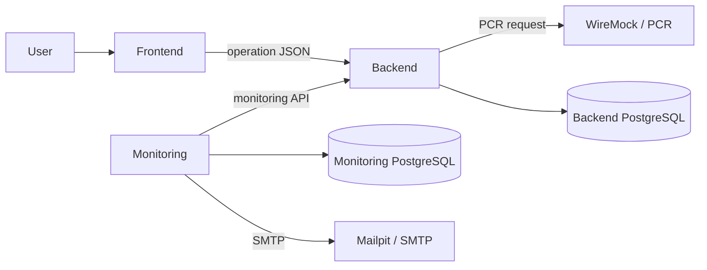
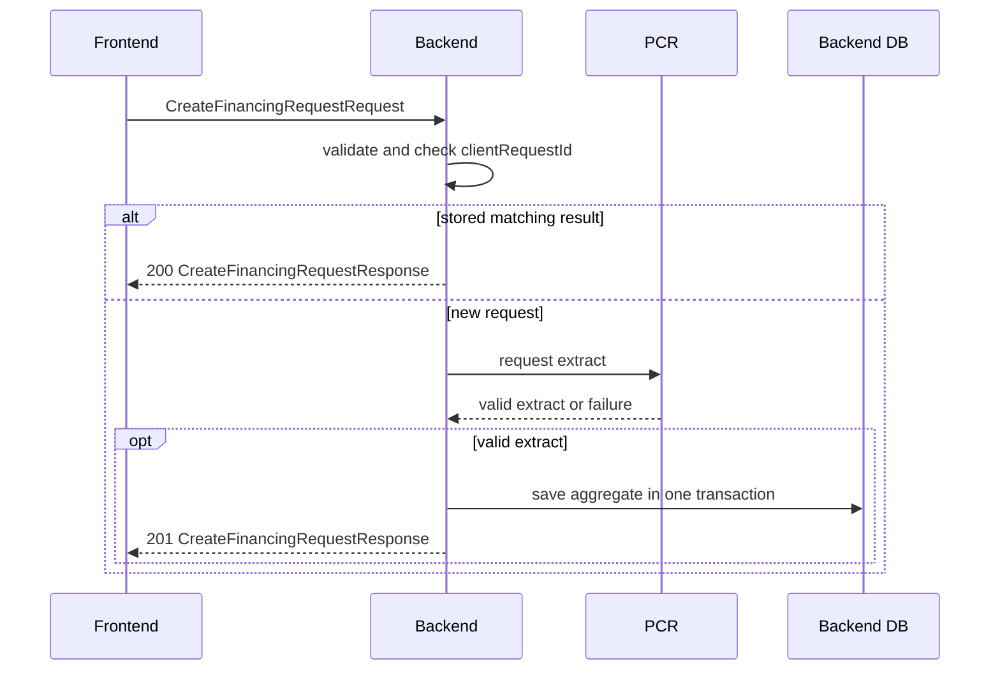

# Credit Lens boundaries and data flows

This document gives a current, compact view of how data crosses the frontend,
backend, Positive Credit Register (PCR), monitoring, and email boundaries. It
is intended for reviewers and developers who need the main flows without a
catalog of every leaf DTO.

## System boundaries

The frontend uses public operation DTOs. The backend domain owns successful
financing requests and immutable extracts. Persistence entities remain inside
the backend, and the monitoring service receives only the dedicated masked API
projection.

## 1. Create request

1. The frontend sends `CreateFinancingRequestRequest` with a new
   `clientRequestId`, full personal identity code, and one or more purposes.
2. The backend validates the payload and checks the request ID.
3. A matching stored result is mapped to
   `CreateFinancingRequestResponse` and returned without another PCR call.
4. A new request is mapped to the PCR transport model and sent synchronously,
   with no database transaction open.
5. A valid PCR response is mapped to domain values.
6. One short transaction stores or reuses `Consumer`, then stores
   `FinancingRequest` and `CreditExtract`.
7. The response mapper returns a masked consumer and extract summary.

PCR failure produces a safe problem response and no stored aggregate. Reusing
the same ID with different input returns `409 Conflict`. Concurrent matching
calls can both reach PCR; exactly-once upstream execution is outside the PoC.

## 2. History and details

History search sends `SearchFinancingRequestsRequest` in a POST body so the
full identity code does not enter the URL. The backend performs a paginated
database query and returns `SearchFinancingRequestsResponse`, ordered newest
first. Each `FinancingRequestHistoryItemDto` contains masked identity data and
summary identifiers only.

Selecting a row calls `GET /api/v1/financing-requests/{id}`. The backend loads
the stored request and its extract, restores the domain aggregate, and maps it
to `GetFinancingRequestDetailsResponse`. The detail response includes the
extract summary, repayment and leasing totals, loans, delayed amounts, and
income data; it never calls PCR.

Only requests joined to an extract appear in history. This reflects the domain
invariant that a persisted financing request is a successful result.

## 3. Monitoring report

1. The scheduler chooses `[completedFrom, completedTo)` from the latest stored
   report interval, or from the configured initial lookback.
2. The monitoring client pages through
   `GET /api/v1/monitoring/financing-requests`.
3. The backend query selects extracts with an active voluntary ban and returns
   `ListMonitoringFinancingRequestsResponse` in stable order.
4. The monitoring service validates all pages before opening a transaction.
5. It renders and stores one immutable report plus ordered item snapshots.
6. It sends the stored report through SMTP outside a transaction.
7. A short transaction changes delivery metadata to `SENT` or `FAILED`.

A later run retries the oldest undelivered report before creating a new one.
`CREATED`, `SENT`, and `FAILED` are report-delivery statuses, not
financing-request statuses.

## Privacy boundary

The full personal identity code is accepted only in create and history-search
request bodies, used for backend validation and lookup, and stored in the
backend database. It must not cross any response, URL, error, log, metric,
trace, monitoring snapshot, or email boundary.

The backend masks the value before returning frontend history/details or a
monitoring item. The monitoring database and report body store only the masked
form. Correlation IDs support troubleshooting without echoing sensitive input.

## Operation DTOs

| Flow | Request | Response |
| --- | --- | --- |
| Create | `CreateFinancingRequestRequest` | `CreateFinancingRequestResponse` |
| Search history | `SearchFinancingRequestsRequest` | `SearchFinancingRequestsResponse` |
| Get details | Path UUID | `GetFinancingRequestDetailsResponse` |
| List for monitoring | `ListMonitoringFinancingRequestsRequest` | `ListMonitoringFinancingRequestsResponse` |

For field-level contracts, use the [API contract](api-contract.md). For
aggregate rules, use the [domain model](domain-model.md). For storage and
transactions, use the [data model](data-model.md).
