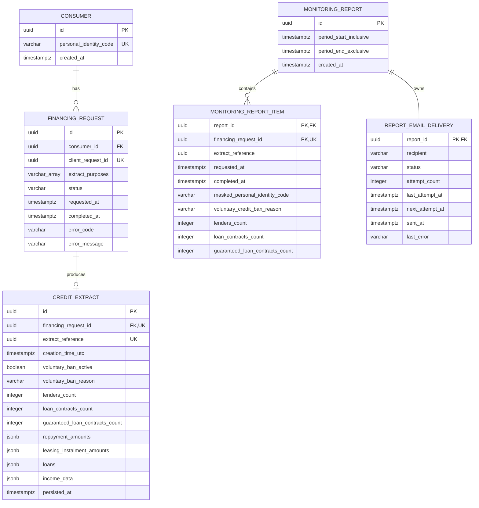

# Credit Lens data model

Version: `v1`

This document maps the concepts from [domain-model.md](domain-model.md) to
PostgreSQL. It describes logical tables and constraints; migrations remain the
executable source of truth once implementation starts.

## Data ownership

The backend owns consumers, financing requests and credit extracts. The
monitoring service owns reports, report items and email-delivery state.

The PoC may run both databases in one PostgreSQL container, but each service
uses its own database or schema and credentials. There are no foreign keys
across service boundaries. The monitoring service receives backend IDs through
the monitoring API and stores them as external references.

## Relationship diagram

The relationship from `monitoring_report_item.financing_request_id` to the
backend is logical only and is intentionally not shown as a database foreign
key.

## Backend database

### `consumer`

| Column | Type | Rules |
| --- | --- | --- |
| `id` | `uuid` | Primary key |
| `personal_identity_code` | `varchar(11)` | Required and unique after normalization |
| `created_at` | `timestamptz` | Required |

The PoC stores the personal identity code as plain text. It must not appear in
logs, metrics, traces or database error messages returned to clients.

### `financing_request`

| Column | Type | Rules |
| --- | --- | --- |
| `id` | `uuid` | Primary key |
| `consumer_id` | `uuid` | Required foreign key to `consumer(id)` |
| `client_request_id` | `uuid` | Required and unique |
| `extract_purposes` | `varchar[]` | Required and non-empty |
| `status` | `varchar(16)` | `IN_PROGRESS`, `COMPLETED` or `FAILED` |
| `requested_at` | `timestamptz` | Required |
| `completed_at` | `timestamptz` | Required for terminal states |
| `error_code` | `varchar(64)` | Required only for `FAILED` |
| `error_message` | `varchar(500)` | Optional sanitized failure detail |

Checks enforce these valid shapes:

- `IN_PROGRESS`: `completed_at`, `error_code` and `error_message` are null;
- `COMPLETED`: `completed_at` is set and error fields are null;
- `FAILED`: `completed_at` and `error_code` are set;
- `completed_at >= requested_at` whenever `completed_at` is present;
- `cardinality(extract_purposes) > 0`.

### `credit_extract`

| Column | Type | Rules |
| --- | --- | --- |
| `id` | `uuid` | Primary key |
| `financing_request_id` | `uuid` | Required, unique foreign key to `financing_request(id)` |
| `extract_reference` | `uuid` | Required and unique |
| `creation_time_utc` | `timestamptz` | Required |
| `voluntary_ban_active` | `boolean` | Required |
| `voluntary_ban_reason` | `varchar(64)` | Required only when the ban is active |
| `lenders_count` | `integer` | Required and non-negative |
| `loan_contracts_count` | `integer` | Required and non-negative |
| `guaranteed_loan_contracts_count` | `integer` | Required and non-negative |
| `repayment_amounts` | `jsonb` | Required JSON array, default `[]` |
| `leasing_instalment_amounts` | `jsonb` | Required JSON array, default `[]` |
| `loans` | `jsonb` | Required JSON array, default `[]` |
| `income_data` | `jsonb` | Required JSON array, default `[]` |
| `persisted_at` | `timestamptz` | Required |

`voluntary_ban_reason` is null when `voluntary_ban_active` is false. When the
ban is active, the reason is one of `RiskOfIdentityTheft`,
`ControlOfPersonalFinances` or `Other`.

The nested register structures are stored as JSON because they are immutable,
have no independent lifecycle and vary by loan type. Summary fields used by
monitoring are stored as regular columns so monitoring queries do not depend
on JSON paths.

The database cannot enforce that every completed request has an extract. The
backend enforces this invariant by inserting the extract and changing the
request to `COMPLETED` in one transaction.

## Monitoring database

### `monitoring_report`

| Column | Type | Rules |
| --- | --- | --- |
| `id` | `uuid` | Primary key |
| `period_start_inclusive` | `timestamptz` | Required |
| `period_end_exclusive` | `timestamptz` | Required |
| `created_at` | `timestamptz` | Required |

The pair `(period_start_inclusive, period_end_exclusive)` is unique and the
start must be earlier than the end.

### `monitoring_report_item`

| Column | Type | Rules |
| --- | --- | --- |
| `report_id` | `uuid` | Foreign key to `monitoring_report(id)` |
| `financing_request_id` | `uuid` | Backend request ID; no cross-service foreign key |
| `extract_reference` | `uuid` | Required |
| `requested_at` | `timestamptz` | Required |
| `completed_at` | `timestamptz` | Required |
| `masked_personal_identity_code` | `varchar(32)` | Required; never stores the full code |
| `voluntary_credit_ban_reason` | `varchar(64)` | Required |
| `lenders_count` | `integer` | Required and non-negative |
| `loan_contracts_count` | `integer` | Required and non-negative |
| `guaranteed_loan_contracts_count` | `integer` | Required and non-negative |

The primary key is `(report_id, financing_request_id)`.
`financing_request_id` is also unique, preventing a request from being copied
into more than one scheduled report.

Report items are snapshots. They are inserted with the report and are never
updated.

### `report_email_delivery`

| Column | Type | Rules |
| --- | --- | --- |
| `report_id` | `uuid` | Primary key and foreign key to `monitoring_report(id)` |
| `recipient` | `varchar(320)` | Required |
| `status` | `varchar(16)` | `PENDING`, `SENDING`, `SENT` or `FAILED` |
| `attempt_count` | `integer` | Required, non-negative, default `0` |
| `last_attempt_at` | `timestamptz` | Nullable |
| `next_attempt_at` | `timestamptz` | Nullable |
| `sent_at` | `timestamptz` | Required only for `SENT` |
| `last_error` | `varchar(1000)` | Required only for `FAILED` |

The report content is not changed when delivery state changes.

State checks require `sent_at` for `SENT` and `last_error` for `FAILED`.
Successful delivery clears `next_attempt_at` and `last_error`.

## Indexes

Backend indexes:

- `financing_request(consumer_id, requested_at DESC, id DESC)` for history;
- `financing_request(completed_at, id) WHERE status = 'COMPLETED'` for the
  monitoring interval query;
- `credit_extract(financing_request_id) WHERE voluntary_ban_active = true` for
  joining active-ban extracts.

Monitoring indexes:

- unique `(period_start_inclusive, period_end_exclusive)` on
  `monitoring_report`;
- `report_email_delivery(status, next_attempt_at)` for pending retries.

## Transactions

1. Creating a request upserts the consumer and inserts an `IN_PROGRESS`
   financing request in one transaction.
2. A successful register call inserts the credit extract and changes the
   request to `COMPLETED` in one transaction.
3. A failed register call changes the request to `FAILED` in one transaction.
4. Report creation inserts the report, its items and the initial `PENDING`
   email delivery in one monitoring transaction.
5. Each email attempt updates only `report_email_delivery`.

No database transaction remains open during an external HTTP or SMTP call.

## Migration and production notes

- Java services should manage schema changes with Flyway migrations.
- Production storage must encrypt or tokenize personal identity codes and use
  a separate deterministic lookup value.
- Database backups and exports must be treated as sensitive data.
- Retention and deletion periods require a business and legal decision and are
  not defined by this PoC.
