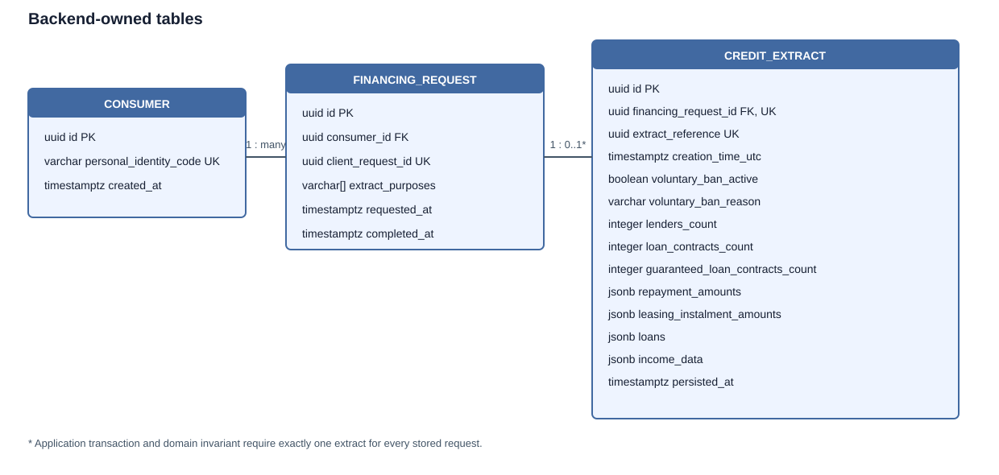

# Credit Lens data model

Version: `v2`

The backend owns three tables. A FinancingRequest is created only after a
successful PCR response, so every stored request is already successful.

## `consumer`

`id`, unique `personal_identity_code`, and `created_at` are required. The PoC
stores the identity code for lookup, but it must never appear in logs, URLs,
responses or database errors.

## `financing_request`

Required columns are `id`, `consumer_id`, unique `client_request_id`, non-empty
`extract_purposes`, `requested_at` and `completed_at`. The database retains no
status, error code, error message or state-transition constraints. The unique
client request ID provides simple idempotency.

## `credit_extract`

`financing_request_id` is a unique foreign key. PCR data is immutable and
stored in regular summary columns plus JSON arrays for nested register data.
The extract and its request are inserted in the same transaction.

## Indexes

- `(consumer_id, requested_at DESC, id DESC)` supports history;
- `(completed_at, id)` supports monitoring intervals;
- the unique request/extract relationship supports successful-fetch joins.

## Transaction boundary

1. Read `find(clientRequestId)` without opening a write transaction.
2. Call PCR synchronously with no database transaction.
3. Open one short `TransactionTemplate` transaction.
4. Save or reuse Consumer, then save FinancingRequest and CreditExtract.
5. Commit and return the response.

The PoC intentionally does not reserve `clientRequestId` before PCR. Two
concurrent calls may both call PCR; the unique constraint prevents two stored
requests. Exactly-once PCR execution is outside scope.

## Monitoring service database

The monitoring service owns a separate PostgreSQL database. It never connects
to the backend database and receives only the masked monitoring API snapshot.

### `monitoring_report`

Each immutable report stores its UUID, half-open interval, recipient, subject,
fully rendered UTF-8 plain-text body, content type, item count, creation time,
delivery timestamps, attempts, safe last-error summary, and one of `CREATED`,
`SENT`, or `FAILED`. The schema enforces `interval_start < interval_end`, a
unique interval, valid states, and non-negative counts. Delivery transitions
are `CREATED -> SENT`, `CREATED -> FAILED`, `FAILED -> SENT`, and `FAILED ->
FAILED`.

### `monitoring_report_item`

Items are immutable snapshots linked to a report and ordered by a unique
ordinal. They retain only masked identity code, requested/completed timestamps,
voluntary-ban reason, and the three summary counts. They never store a full
personal identity code, financing-request ID, or extract reference.

### Monitoring transaction boundaries

1. Fetch and validate every backend API page outside a database transaction.
2. In a short transaction, persist the report, ordered item snapshots and
   already-rendered subject/body.
3. Send SMTP outside a database transaction.
4. In another short transaction, update only delivery metadata.

When SMTP fails, a subsequent run delivers the stored subject/body without
calling the backend again. The checkpoint is the maximum persisted
`interval_end`; therefore an unavailable/invalid backend response creates no
report and does not advance the interval. SMTP acknowledgement followed by a
process crash before the `SENT` commit can cause a duplicate delivery, so the
PoC intentionally offers at-least-once rather than exactly-once email delivery.
