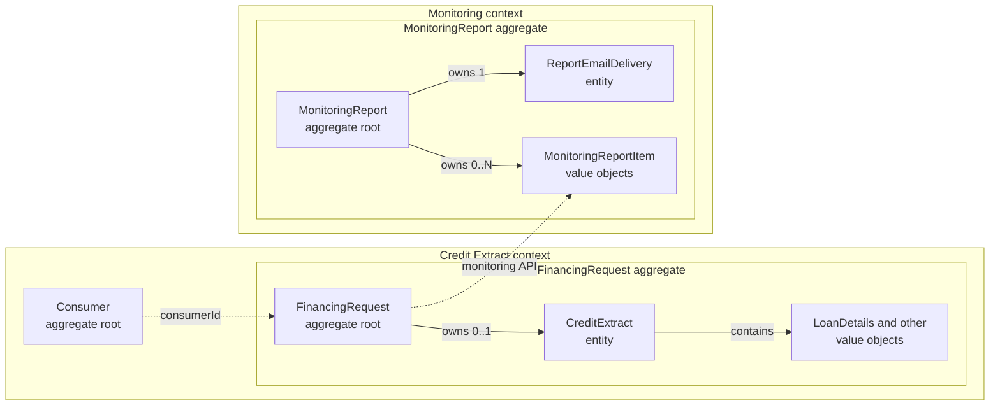

# Credit Lens domain model

Version: `v3`

## Purpose

This model describes how Credit Lens requests and stores credit extracts and
how it reports financing requests made for consumers with an active voluntary
credit ban. It is intentionally limited to the proof of concept.

API payloads are defined in [api-contract.md](api-contract.md). PostgreSQL
tables and constraints are defined in [data-model.md](data-model.md).

## Domain boundaries

### Credit Extract context

The backend owns consumers, financing requests and immutable credit extracts.
It is the only component that calls the Positive Credit Register and writes
credit-extract data.

### Monitoring context

The monitoring service owns monitoring reports and email-delivery state. It
reads report candidates through the backend monitoring API and never reads the
backend database directly.

### External systems

- The Positive Credit Register is represented by a mock REST API.
- The email provider is represented by a local SMTP server or test adapter.
- The frontend is a client of the backend and does not own business data.

## Ubiquitous language

| Term | Meaning |
| --- | --- |
| `Consumer` | Person whose credit information is requested |
| `PersonalIdentityCode` | Finnish personal identity code, called SSN in the assignment |
| `FinancingRequest` | One user submission that asks for a new credit extract |
| `CreditExtract` | Immutable snapshot returned by the Positive Credit Register |
| `VoluntaryBanOnCredits` | Voluntary credit ban observed in one credit extract |
| `MonitoringReport` | Frozen report for one scheduled time interval |
| `MonitoringReportItem` | Snapshot of one matching financing request inside a report |
| `ReportEmailDelivery` | State of sending one report by email |

`Fetch` is used only as a verb. A fetch-history entry is a
`FinancingRequest`.

## Aggregates

### Consumer aggregate

`Consumer` is the aggregate root. It identifies a person by a normalized
`PersonalIdentityCode`.

The consumer does not store a current credit-ban status. A ban is an
observation in a specific `CreditExtract`; the latest completed request may be
used when a current view is needed.

Rules:

- one normalized personal identity code identifies at most one consumer;
- the full code is accepted only where required as input;
- list and report outputs contain only a masked code.

### FinancingRequest aggregate

`FinancingRequest` is the aggregate root and the entry shown in request
history. It refers to one `Consumer` by `consumerId` and owns zero or one
`CreditExtract`.

Supported operations:

- start a request;
- complete it with a credit extract;
- fail it with an error code and message.

The client assigns one `clientRequestId` to one user submission. A technical
retry uses the same value and returns the existing `FinancingRequest`. A new
user submission uses a new value.

`CreditExtract` is an immutable entity created only when a request completes.
It keeps the register reference and creation time together with these value
objects from the register response:

- `VoluntaryBanOnCredits`;
- `CreditInformationSummary`;
- `LoanDetails`;
- `IncomeData`.

`LoanDetails` has no independent identity because the register extract does
not provide a stable loan ID. Type-specific structures such as
`lumpSumLoan`, `runningAccountLoan` and `leasingContract` remain separate and
retain their register meaning.

### MonitoringReport aggregate

`MonitoringReport` is the aggregate root. It owns immutable
`MonitoringReportItem` values and one mutable `ReportEmailDelivery` entity.

Supported operations:

- create a report for a closed time interval;
- start email delivery;
- record a delivery failure;
- mark the email as sent;
- retry a failed delivery without rebuilding report items.

The report content never changes after creation. Recreating the same scheduled
interval returns the existing report.

## Domain diagram



The dotted lines cross aggregate or context boundaries and carry identifiers
or API data, not direct object references.

## State transitions

### FinancingRequest

```text
IN_PROGRESS -> COMPLETED
IN_PROGRESS -> FAILED
```

An `IN_PROGRESS` request has neither an extract nor failure details. A
`COMPLETED` request has exactly one extract. A `FAILED` request has failure
details and no extract.

### ReportEmailDelivery

```text
PENDING -> SENDING -> SENT
SENDING -> FAILED
FAILED -> SENDING
```

An email failure changes only delivery state. It never changes report content
or backend data.

## Context interactions

| From | To | Interaction |
| --- | --- | --- |
| Frontend | Backend | Start a financing request |
| Frontend | Backend | Read request history and request details |
| Backend | Positive Credit Register mock | Request a credit extract |
| Monitoring service | Backend monitoring API | Read report candidates for a completed interval |
| Monitoring service | Email provider | Send a monitoring report |

For a half-open interval `[start, end)`, the backend monitoring API returns
requests that:

1. have status `COMPLETED`;
2. have `completedAt` inside the interval;
3. contain `VoluntaryBanOnCredits.isInEffect = true`.

The interval uses `completedAt` because the ban status is unknown until the
extract has been received and stored. Results are ordered by `completedAt` and
request ID. The full personal identity code is never returned by this API.

## Business invariants

1. Every financing request belongs to exactly one consumer.
2. A `clientRequestId` identifies at most one financing request.
3. A completed financing request has exactly one immutable credit extract.
4. An in-progress or failed financing request has no credit extract.
5. The register `extractReference` is unique.
6. A report interval has a unique report.
7. A financing request appears at most once in a report.
8. Report periods and report items do not change after report creation.
9. A retry sends the stored report instead of rebuilding it.
10. All timestamps are stored in UTC.
11. Personal identity codes are never written to logs.

## PoC trade-offs

- The personal identity code is stored as plain text. Production storage must
  use encryption or tokenization and stricter access controls.
- The backend call is synchronous, but `IN_PROGRESS` is persisted before the
  external call starts.
- A small reconciliation task marks abandoned `IN_PROGRESS` requests as
  `FAILED` with `PCR_CALL_INTERRUPTED`.
- The mock supports the standard successful response for a living consumer;
  the separate deceased-person response is outside scope.
- Monitoring polls the backend; an event stream or outbox is not required for
  the expected PoC volume.
- One email is sent per report. Other delivery channels are outside scope.
- Authentication and authorization are outside scope and must be added before
  production use.
