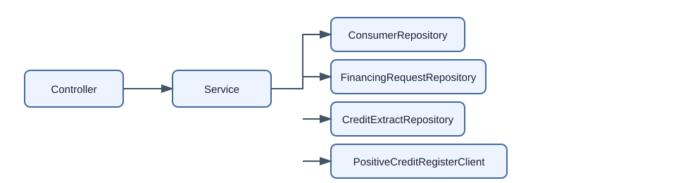

# Credit Lens domain model

## Backend aggregate

`FinancingRequest` is a successful, immutable result of one synchronous PCR
fetch. It contains:

- `clientRequestId` for simple idempotency;
- a `Consumer` and its request purposes;
- `requestedAt` and `completedAt`;
- exactly one immutable `CreditExtract`.

There is deliberately no `FinancingRequestStatus`, `errorCode`, `errorMessage`,
failed/in-progress record, state validation or lifecycle transition. A stored
request is successful because it has a stored extract.

`PersonalIdentityCode` is a value object that validates input, redacts its
`toString()` value and exposes only a masked form at the API boundary.

## Components

The controller validates `CreateFinancingRequestRequest`, calls
`FinancingRequestService.create()` and returns
`CreateFinancingRequestResponse`. It never accesses repositories, PCR or JPA
entities.

The service performs the idempotency lookup, calls PCR outside a transaction,
coordinates the three repositories in one final transaction and maps domain
data to the response DTO.

## Monitoring

Monitoring selects extracts with an active voluntary credit ban by a half-open
`completedAt` interval. It uses the extract's existence as the success signal;
there is no financing-request status filter.

## PoC trade-off

The request ID is not reserved before PCR. Concurrent identical requests may
both call PCR, while the unique database constraint prevents duplicate stored
requests. Exactly-once upstream execution and recovery of abandoned calls are
not part of this minimal synchronous PoC.
